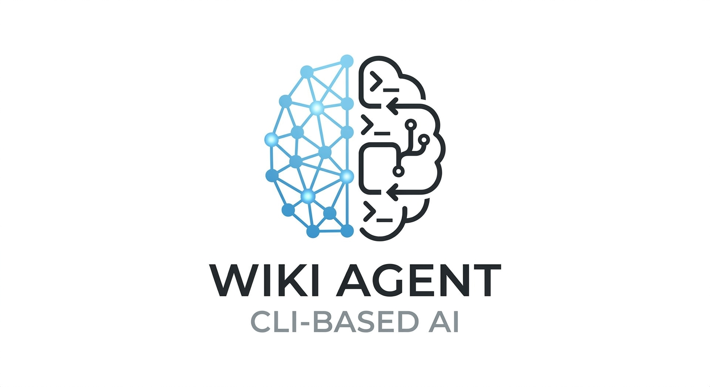

# llm-wiki-skill

<p align="center">
  
</p>

A CLI based agentic skill that manages your wiki for you, works with LLMs of your choice. This project is inspired by [Andrej Karpathy LLM wiki idea](https://gist.github.com/karpathy/442a6bf555914893e9891c11519de94f), with extension of not only solving the research problems but also personal learnings and beyond.

Wikis are updated by LLMs, you only source raw materials, this skill will help you generate the inter-connections among concepts and build the second brain for you.

## Why CLI? Can we use it without CLI agents?

Handling pure file operations is straightforward and fast from CLI given the coding agents already have access to your environment variables and such. It would be efficient than other heavy lifting methods such as MCP, REST apis etc. This skill is designed natively for CLI environments, you cannot run it without CLI agents.

## Getting Started

### Prerequisites

You only need Python 3.10+ in your system to execute the SKILL. If not you can download [uv](https://docs.astral.sh/uv/getting-started/installation/).

After download, run below command to pin your local python version to 3.10, you can choose a higher version if you want.

```bash
uv python pin 3.10
```

Then, make sure you have `npx` which comes with Node.js [installation](https://nodejs.org/en/download). Then verify it's downloaded

```bash
npx -v
```

### Install Skill

```bash
npx skills add aaronoah/llm-wiki-skill
```

__Note:__ make sure you install the skill under `~/.agents` for global setting, any CLI agents (Codex, Claude Code, Gemini etc) can use that. If you prefer to install per project, you need to manually edit `SKILL.md` script path to point to your project root level.

## Usage

The SKILL is configured to be activated when you:
- Create, or start a wiki or knowledge base
- Ingest, add, or process original content into a wiki
- Asks questions about a wiki or knowledge base
- Lint, audit, or health-check the wiki, make sure they are in good shape

__Note:__ you have to activate your agent (Codex Cli, Gemini Cli, Claude Code Cli etc) on the root level of your wiki such as `llm-wiki/`, otherwise the skill will not work.

## Obsidian Integrations

Obsidian is a great note taking tool that helps organize your docs and setup cross-references between them. You can have a good visualization of your knowledge base in a graph view.

Recommend to use [Obsidian Web Clipper](https://obsidian.md/clipper) to capture the web pages and directly ingest a markdown file into your local computer to be used by Obsidian app.

## New Features in planning

|         Function of the skill                                       |Supported? (✅/❌)|
|---------------------------------------------------------------------|----------------------------------|
| Self correction based on logged failures after applying lint rules  |      ❌                          |
| Parsing multimedia content and improve wiki context                 |      ❌                          |
| Build file based embeddings to help speed up queries when wiki grows large | ❌                        |

## License

[MIT](LICENSE)